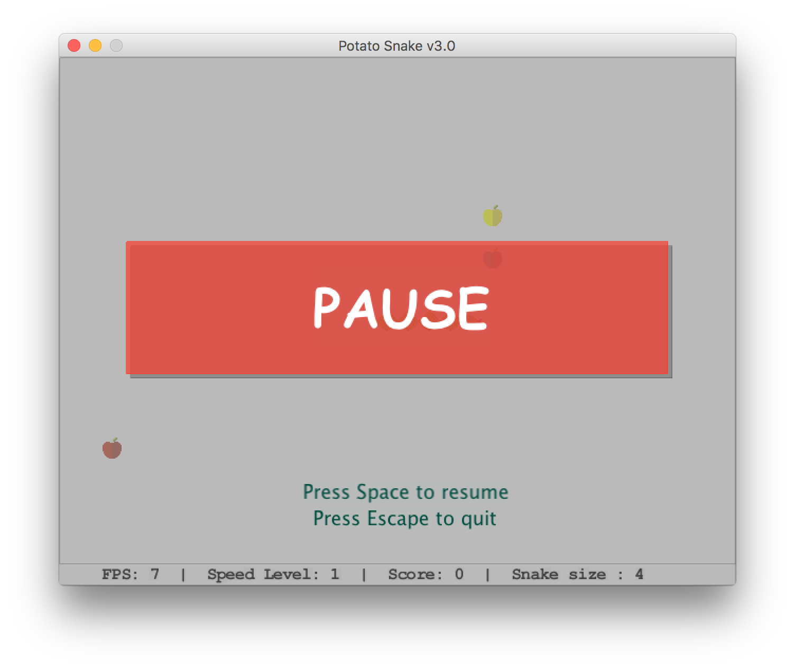
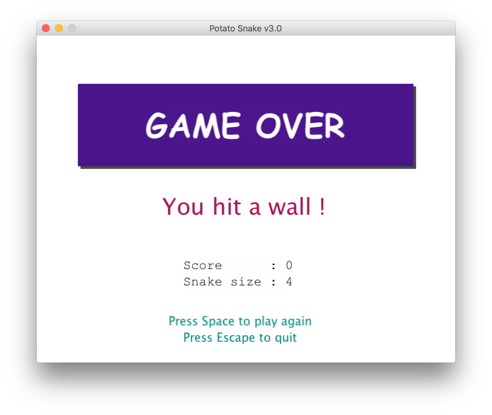

# TUD15A mashed potatoes
A simple snake developed during 2017 March Athens program session

## Quick Start

1. Clone repo `git clone https://github.com/PercevalSA/TUD15A-mashed-potatoes.git`
2. Open the project in IntelliJ IDEA
3. Click on "Run > Run..."
4. Click on "0. Edit Configuration..."
5. On "VM Options" put the following : `-Djava.library.path=<lwjgl-X.X path>/native/<linux|macosx|solaris|windows>`
    * In my case, I have : `-Djava.library.path=./lib/lwjgl-2.9.3/native/macosx`
6. Run the game
7. Enjoy ;)

## Features
* Main menu and GameOver menu
* Pause menu with space bar
* 5 levels from 0 to 4 : the speed of the snake increase accordingly
* 2 types of apple : the red are sweet (+2) and the blue poisonned (-1)

## Some Screenshots

### V 3.0

### V 3.0 Start Menu

### V 3.0 Pause

### V 3.0 Game Over

### V 2.0

### V 2.0 Start Menu

### V 2.0 Pause Menu

### V 1.0

