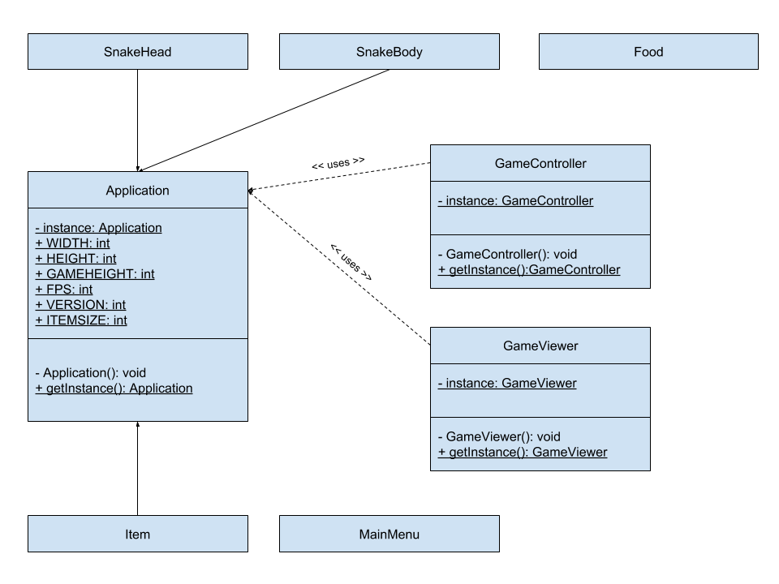
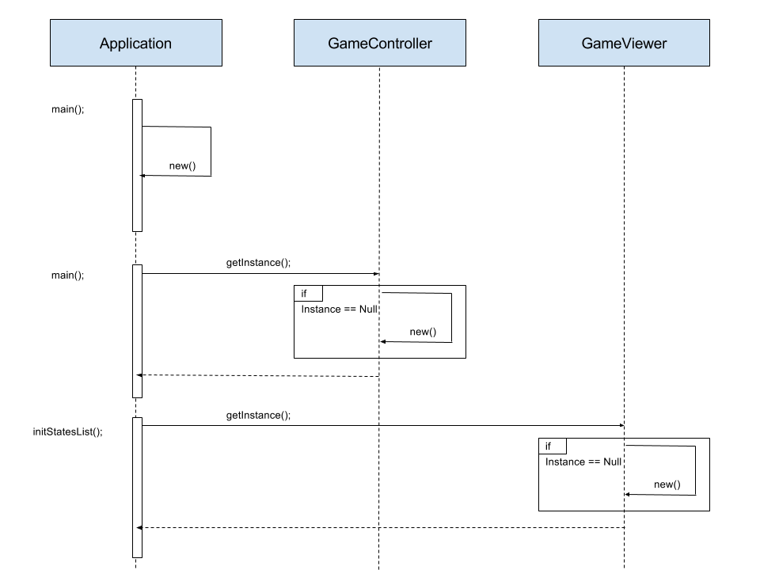

# Assignement 1

## Singleton

1. Write a natural language description of why and how the pattern is implemented in your code.

We implemented the singleton pattern in the `Application`, `GameController` and `GameViewer`. 
We assume there is only one game running at the time. So there is only one application and one controller.
Moreover there is only one window so one viewer.
Our objective is to access all three objects from anywhere in the code (in any object) while guaranteeing it is always the same instances.
We don't use multi-threading so we don't need to `synchronise` constructors. As such, all three singletons look like :

```java
private static Class instance;

public static Class getInstance() {
    if(instance == null) {
        instance = new Game();
    }
    return instance;
}
```

2. Make a class diagram of how the pattern is structured statically in your code.

All `public static` variables are final for security reasons.


3. Make a sequence diagram of how the pattern works dynamically in your code.


## Behaviour

1. Write a natural language description of why and how the pattern is implemented in your code.

We implemented behaviors for the food that the snake is eating. Thanks to our implementation, we can combine multiple behaviors without inheritance. Furthermore, we can change the behaviour during runtime. The pattern is implemented using a TasteBehavior interface. TasteBad and TasteGood implement the interface and define the color of the food and its effect. It also allows to easily integrate future behaviors following the open-closed principle.

2. Make a class diagram of how the pattern is structured statically in your code.

3. Make a sequence diagram of how the pattern works dynamically in your code.

